# Database Design Detail

## 1. Tổng Quan Database

Database phục vụ hệ thống đặt sân thể thao Laravel + Vue, bao gồm người dùng, phân quyền, đăng ký chủ sân, quản lý sân/cụm sân, cấu hình giá, đặt sân, thanh toán, hoàn tiền, tuyển người chơi, đánh giá, báo cáo vi phạm, khiếu nại, thông báo, chat, audit log, dashboard analytics, chính sách hệ thống, banner, bài viết cộng đồng và sân yêu thích.

- Database engine hiện tại: MySQL.
- ORM: Laravel Eloquent.
- Primary key:
  - Phần lớn bảng nghiệp vụ dùng UUID `CHAR(36)`/`uuid` với default `UUID()` và model `HasUuids`.
  - Bảng RBAC, pivot, queue/cache và một số cấu hình dùng auto-increment bigint/string key.
- Naming convention:
  - Tên bảng dạng snake_case số nhiều: `venue_clusters`, `player_post_participants`.
  - Foreign key dạng `{entity}_id`: `user_id`, `cluster_id`, `booking_id`.
  - Polymorphic dùng cặp `{name}_type`, `{name}_id`: `mediable_type`/`mediable_id`, `reportable_type`/`reportable_id`.
- Timestamp convention:
  - Bảng nghiệp vụ thường có `created_at`, `updated_at`.
  - Một số bảng append-only hoặc pivot chỉ có `created_at`.
  - Laravel infrastructure tables dùng cấu trúc mặc định của Laravel.
- Soft delete:
  - Có `softDeletes()` cho `court_types` và `venue_courts`.
  - Các bảng còn lại chủ yếu hard delete hoặc đổi `status`.
- JSON fields:
  - Migrations dùng `jsonb()` ở một số trường; trên MySQL được dùng như JSON-compatible storage qua Laravel.
- Status convention:
  - Trạng thái quan trọng được giới hạn bằng `CHECK` constraint ở migration khi có thể.
  - Các flow nghiệp vụ dùng `status` thay vì xóa dữ liệu: booking, payment, report, complaint, venue, player post.

## 2. Nhóm Bảng Chính

| Module | Bảng |
|---|---|
| Authentication / User | `users`, `sessions`, `personal_access_tokens`, `verification_codes` |
| RBAC / Permission | `roles`, `permissions`, `role_permissions`, `user_roles`, `user_permission_revokes` |
| Partner Application | `partner_applications`, `media` |
| Venue / Court / Media | `court_types`, `venue_clusters`, `venue_courts`, `media`, `venue_view_events` |
| Pricing / Booking Config | `booking_configs`, `price_slots`, `holiday_prices` |
| Booking / Slot Lock | `bookings`, `slot_locks` |
| Payment / Refund / Finance | `payments`, `refunds`, `platform_fee_configs`, `venue_fee_ledgers` |
| Recruitment / Player Posts | `player_posts`, `player_post_participants`, `player_ratings` |
| Review / Rating / Report / Complaint | `reviews`, `player_ratings`, `reports`, `complaints` |
| Notification / Chat / Audit | `notifications`, `conversations`, `conversation_participants`, `messages`, `audit_logs` |
| System / Content / Community | `moderation_configs`, `system_policies`, `banners`, `system_posts`, `community_posts`, `community_post_likes`, `community_post_comments`, `favorite_venues` |
| Infrastructure | `cache`, `cache_locks`, `jobs`, `job_batches`, `failed_jobs` |

## 3. ERD Tổng Quan

```mermaid
erDiagram
    users ||--o{ sessions : "user_id"
    users ||--o{ personal_access_tokens : "tokenable_id"
    users ||--o{ verification_codes : "user_id"

    users ||--o{ user_roles : "user_id"
    roles ||--o{ user_roles : "role_id"
    roles ||--o{ role_permissions : "role_id"
    permissions ||--o{ role_permissions : "permission_id"
    users ||--o{ user_permission_revokes : "user_id"
    permissions ||--o{ user_permission_revokes : "permission_id"

    users ||--o{ partner_applications : "user_id"
    users ||--o{ venue_clusters : "owner_id"
    users ||--o{ venue_clusters : "approved_by/locked_by"
    venue_clusters ||--|| booking_configs : "cluster_id"
    venue_clusters ||--o{ venue_courts : "cluster_id"
    court_types ||--o{ venue_courts : "court_type_id"
    venue_clusters ||--o{ price_slots : "cluster_id"
    venue_clusters ||--o{ holiday_prices : "cluster_id"
    venue_clusters ||--o{ venue_view_events : "cluster_id"

    users ||--o{ bookings : "customer_id/created_by"
    venue_clusters ||--o{ bookings : "cluster_id"
    venue_courts ||--o{ bookings : "court_id"
    venue_courts ||--o{ slot_locks : "court_id"
    bookings ||--o{ slot_locks : "booking_id"

    bookings ||--o{ payments : "booking_id"
    payments ||--o{ refunds : "payment_id"
    bookings ||--o{ refunds : "booking_id"
    bookings ||--o| venue_fee_ledgers : "booking_id"
    venue_clusters ||--o{ venue_fee_ledgers : "cluster_id"
    users ||--o{ platform_fee_configs : "created_by"

    bookings ||--o| reviews : "booking_id"
    venue_clusters ||--o{ reviews : "cluster_id"
    users ||--o{ reviews : "customer_id"
    bookings ||--o{ complaints : "booking_id"
    users ||--o{ complaints : "customer_id/resolved_by"

    users ||--o{ player_posts : "author_id"
    venue_clusters ||--o{ player_posts : "venue_cluster_id"
    bookings ||--o{ player_posts : "booking_id"
    court_types ||--o{ player_posts : "court_type_id"
    player_posts ||--o{ player_post_participants : "post_id"
    users ||--o{ player_post_participants : "user_id"
    player_posts ||--o{ player_ratings : "post_id"
    users ||--o{ player_ratings : "rater_id/rated_user_id"

    users ||--o{ reports : "reporter_id/reviewed_by"
    users ||--o{ notifications : "user_id"
    users ||--o{ audit_logs : "actor_id"

    users ||--o{ conversations : "created_by"
    conversations ||--o{ conversation_participants : "conversation_id"
    users ||--o{ conversation_participants : "user_id"
    conversations ||--o{ messages : "conversation_id"
    users ||--o{ messages : "sender_id"

    users ||--o{ system_policies : "created_by/updated_by"
    users ||--o{ banners : "created_by/updated_by"
    users ||--o{ system_posts : "author_id"
    users ||--o{ community_posts : "author_id"
    venue_clusters ||--o{ community_posts : "venue_cluster_id"
    community_posts ||--o{ community_post_likes : "post_id"
    users ||--o{ community_post_likes : "user_id"
    community_posts ||--o{ community_post_comments : "post_id"
    community_post_comments ||--o{ community_post_comments : "parent_id"
    users ||--o{ community_post_comments : "user_id"
    users ||--o{ favorite_venues : "user_id"
    venue_clusters ||--o{ favorite_venues : "venue_cluster_id"

    media }o--|| users : "polymorphic"
    media }o--|| venue_clusters : "polymorphic"
    media }o--|| partner_applications : "polymorphic"
    reports }o--|| users : "polymorphic"
    reports }o--|| venue_clusters : "polymorphic"
    reports }o--|| bookings : "polymorphic"
    reports }o--|| reviews : "polymorphic"
    reports }o--|| player_posts : "polymorphic"
    reports }o--|| player_ratings : "polymorphic"
    reports }o--|| community_posts : "polymorphic"
```

Ghi chú ERD:

- `media`, `reports`, `notifications.reference_*`, `conversations.reference_*`, và `audit_logs.entity_*` là quan hệ polymorphic/logical reference nên không có FK vật lý tới tất cả target tables.
- `personal_access_tokens` dùng `uuidMorphs('tokenable')`; target chính là `users`.
- `slot_locks.locked_by` là string để hỗ trợ user id hoặc session id, không có FK vật lý.

## 4. Authentication / User

### `users`

Lưu tài khoản người dùng, chủ sân, nhân viên sân và admin.

| Field | Type | Null | Ghi chú |
|---|---:|---:|---|
| `id` | uuid PK | no | Default `UUID()`, Eloquent `HasUuids` |
| `full_name` | string | no | Họ tên |
| `email` | string unique | no | Email đăng nhập |
| `phone` | string(15) unique index | yes | Số điện thoại |
| `email_verified_at` | timestamp | yes | Xác thực email |
| `phone_verified_at` | timestamp | yes | Xác thực phone |
| `password` | string | no | Hashed, hidden in model |
| `avatar_url` | string(500) | yes | Avatar URL nhanh; media polymorphic cũng có thể dùng |
| `status` | string(20) | no | `pending_verify`, `active`, `locked` |
| `lock_reason` | text | yes | Lý do khóa tài khoản |
| `locked_at` | timestamp | yes | Thời điểm khóa |
| `locked_by` | uuid FK users | yes | Admin/system actor khóa |
| `bio` | text | yes | Giới thiệu cá nhân |
| `address`, `ward`, `district`, `city` | text/string | yes | Địa chỉ hồ sơ |
| `preferred_sports` | json | yes | Môn thể thao ưa thích |
| `preferred_position` | string(50) | yes | Vị trí ưa thích |
| `player_rating_avg` | decimal(3,2) | no | Điểm uy tín người chơi |
| `player_rating_count` | integer | no | Số lượt rating người chơi |
| `remember_token` | string | yes | Laravel remember token |
| `created_at`, `updated_at` | timestamp | yes | Laravel timestamps |

Ràng buộc:

- `email` unique.
- `phone` unique index `idx_users_phone`.
- `status` check: `pending_verify`, `active`, `locked`.
- `locked_by` null-on-delete tới `users.id`.

Quan hệ chính:

- 1 user có nhiều roles qua `user_roles`.
- 1 user có nhiều bookings, reviews, reports, complaints, player posts, notifications, messages.
- 1 user có thể sở hữu nhiều `venue_clusters`.
- 1 user có thể bị report qua polymorphic `reports`.

### `sessions`

Laravel session database driver.

| Field | Type | Ghi chú |
|---|---:|---|
| `id` | string PK | Session id |
| `user_id` | uuid FK nullable | User đang đăng nhập, cascade delete |
| `ip_address` | string(45) nullable | IP |
| `user_agent` | text nullable | User agent |
| `payload` | longText | Session payload |
| `last_activity` | integer index | Timestamp hoạt động cuối |

### `personal_access_tokens`

Laravel Sanctum token table.

| Field | Type | Ghi chú |
|---|---:|---|
| `id` | bigint PK | Auto increment |
| `tokenable_type`, `tokenable_id` | morph uuid | Chủ thể token, thường là `User` |
| `name` | text | Token name |
| `token` | string(64) unique | Hash token |
| `abilities` | text nullable | Quyền token |
| `last_used_at`, `expires_at` | timestamp nullable | Tracking token |
| `created_at`, `updated_at` | timestamp | Laravel timestamps |

### `verification_codes`

Mã xác thực dùng cho đăng ký, quên mật khẩu, xác thực phone.

| Field | Type | Ghi chú |
|---|---:|---|
| `id` | bigint PK | Auto increment |
| `user_id` | uuid FK nullable | User liên quan, cascade delete |
| `identifier` | string | Email hoặc phone |
| `type` | string(20) | `register`, `reset_password`, `phone_verify` |
| `code` | string | Mã đã hash/token |
| `channel` | string(10) | `email`, `sms` |
| `attempt_count` | smallint | Số lần thử |
| `max_attempts` | smallint | Giới hạn thử, default 5 |
| `is_used` | boolean | Đã dùng hay chưa |
| `expires_at` | timestamp | Hạn dùng |
| `created_at` | timestamp nullable | Tạo lúc |

Indexes/constraints:

- Index `identifier`, `type`, `is_used`.
- Index `expires_at`.
- Check `type` và `channel`.

## 5. RBAC / Permission

### `roles`

| Field | Type | Ghi chú |
|---|---:|---|
| `id` | bigint PK | Auto increment |
| `name` | string(50) unique | Code role: `super_admin`, `player`, ... |
| `display_name` | string(100) | Tên hiển thị |
| `description` | text nullable | Mô tả |
| `is_system` | boolean | Role hệ thống |
| `created_at`, `updated_at` | timestamp | Laravel timestamps |

Seeder tạo 5 role mặc định:

- `super_admin`
- `system_staff`
- `venue_owner`
- `venue_staff`
- `player`

### `permissions`

| Field | Type | Ghi chú |
|---|---:|---|
| `id` | bigint PK | Auto increment |
| `code` | string(100) unique | Permission code dùng trong middleware route |
| `name` | string | Tên hiển thị |
| `group_name` | string(50) | Nhóm permission |
| `created_at` | timestamp nullable | Tạo lúc |

Permission groups seed chính: user, role/permission, venue, court, pricing, booking, payment, recruitment, review, report, complaint, notification, chat, audit, system config, partner application, slot lock, dashboard, moderation extension.

### `role_permissions`

Pivot role-permission.

| Field | Type | Ghi chú |
|---|---:|---|
| `role_id` | bigint FK | Cascade delete |
| `permission_id` | bigint FK | Cascade delete |

Ràng buộc:

- Composite primary key: `role_id`, `permission_id`.

### `user_roles`

Gán role cho user theo scope.

| Field | Type | Ghi chú |
|---|---:|---|
| `id` | bigint PK | Auto increment |
| `user_id` | uuid FK | Cascade delete |
| `role_id` | bigint FK | Cascade delete |
| `scope_type` | string(20) | `system` hoặc `venue` |
| `scope_id` | uuid nullable | ID venue khi scope là `venue` |
| `granted_by` | uuid FK users nullable | Người gán quyền |
| `created_at` | timestamp nullable | Tạo lúc |

Ràng buộc:

- Unique composite `user_id`, `role_id`, `scope_type`, `scope_id`.
- Check `scope_type IN ('system', 'venue')`.

### `user_permission_revokes`

Deny-list permission cấp user.

| Field | Type | Ghi chú |
|---|---:|---|
| `id` | bigint PK | Auto increment |
| `user_id` | uuid FK | User bị revoke |
| `permission_id` | bigint FK | Permission bị revoke |
| `scope_type` | string(20) | `system`, `venue` |
| `scope_id` | uuid nullable | Scope cụ thể |
| `revoked_by` | uuid FK nullable | Người revoke |
| `reason` | string nullable | Lý do |
| `created_at` | timestamp nullable | Tạo lúc |

Ràng buộc:

- Unique composite `user_id`, `permission_id`, `scope_type`, `scope_id`.
- Check `scope_type`.

## 6. Partner Application

### `partner_applications`

Hồ sơ đăng ký làm chủ sân/đối tác.

| Field | Type | Ghi chú |
|---|---:|---|
| `id` | uuid PK | Default `UUID()` |
| `user_id` | uuid FK users | Người nộp, cascade delete |
| `business_name` | string | Tên kinh doanh |
| `tax_code` | string(50) nullable | Mã số thuế |
| `status` | string(20) | `pending`, `approved`, `rejected` |
| `reviewed_by` | uuid FK users nullable | Admin duyệt/từ chối |
| `reject_reason` | text nullable | Lý do từ chối |
| `submitted_at` | timestamp | Ngày nộp |
| `reviewed_at` | timestamp nullable | Ngày xử lý |
| `created_at`, `updated_at` | timestamp | Laravel timestamps |

Indexes:

- `user_id`.
- `status`, `submitted_at`.

Media:

- Dùng `media` polymorphic cho license, id card, venue photo.

## 7. Venue / Court / Media

### `court_types`

Loại sân/môn thể thao.

| Field | Type | Ghi chú |
|---|---:|---|
| `id` | bigint PK | Auto increment |
| `name` | string(100) unique | Tên loại sân |
| `description` | text nullable | Mô tả |
| `player_count` | integer | Số người chơi tiêu chuẩn |
| `is_active` | boolean | Có còn dùng |
| `created_at`, `updated_at` | timestamp | Laravel timestamps |
| `deleted_at` | timestamp nullable | Soft delete |

Seeder tạo các loại sân: bóng đá 5/7/11, cầu lông, tennis, pickleball, bóng rổ, bóng chuyền, đa năng.

### `venue_clusters`

Cụm sân do chủ sân quản lý.

| Field | Type | Ghi chú |
|---|---:|---|
| `id` | uuid PK | Default `UUID()` |
| `owner_id` | uuid FK users | Chủ sân, restrict delete |
| `name` | string | Tên cụm sân |
| `slug` | string unique | Slug public |
| `description` | text nullable | Mô tả |
| `phone_contact` | string(15) nullable | SĐT liên hệ |
| `address` | text | Địa chỉ |
| `ward`, `district`, `city` | string nullable | Địa bàn |
| `latitude`, `longitude` | decimal(10,7) nullable | Tọa độ |
| `amenities` | json nullable | Tiện ích |
| `status` | string(20) | `pending`, `active`, `rejected`, `locked` |
| `approved_by` | uuid FK nullable | Admin duyệt |
| `reject_reason` | text nullable | Lý do từ chối |
| `lock_reason` | text nullable | Lý do khóa |
| `locked_at` | timestamp nullable | Ngày khóa |
| `locked_by` | uuid FK nullable | Người khóa |
| `rating_avg` | decimal(3,2) | Điểm review trung bình |
| `rating_count` | integer | Số review |
| `created_at`, `updated_at` | timestamp | Laravel timestamps |

Indexes/constraints:

- `owner_id`, `status`, `city`.
- `idx_venue_active_rating(status, rating_avg DESC)`.
- `idx_venue_geo(latitude, longitude)`.
- Check `status`.

Quan hệ:

- 1 venue cluster có nhiều courts, bookings, price slots, holiday prices, reviews, player posts, community posts, favorite rows.
- 1 venue cluster có 1 `booking_config`.

### `venue_courts`

Sân con thuộc cụm sân.

| Field | Type | Ghi chú |
|---|---:|---|
| `id` | uuid PK | Default `UUID()` |
| `cluster_id` | uuid FK venue_clusters | Cascade delete |
| `court_type_id` | bigint FK court_types | Restrict delete |
| `name` | string(100) | Tên sân con |
| `status` | string(20) | `active`, `maintenance` |
| `sort_order` | integer | Thứ tự hiển thị |
| `created_at`, `updated_at` | timestamp | Laravel timestamps |
| `deleted_at` | timestamp nullable | Soft delete |

Indexes/constraints:

- `idx_courts_cluster(cluster_id)`.
- `idx_courts_cluster_status(cluster_id, status)`.
- Check `status`.

### `media`

Kho media polymorphic dùng chung.

| Field | Type | Ghi chú |
|---|---:|---|
| `id` | uuid PK | Default `UUID()` |
| `mediable_type` | string(50) | Model target |
| `mediable_id` | uuid | ID target |
| `collection` | string(50) | Nhóm media: `cover`, `gallery`, `license`, ... |
| `file_name` | string | Tên file |
| `file_path` | string(500) | Đường dẫn lưu |
| `mime_type` | string(100) | MIME |
| `file_size` | integer | Bytes |
| `sort_order` | smallint | Thứ tự |
| `created_at` | timestamp nullable | Tạo lúc |

Indexes:

- `mediable_type`, `mediable_id`.
- `mediable_type`, `mediable_id`, `collection`.

## 8. Pricing / Booking Config

### `booking_configs`

Config đặt sân theo từng cụm sân, khóa chính chính là `cluster_id`.

| Field | Type | Ghi chú |
|---|---:|---|
| `cluster_id` | uuid PK/FK | 1-1 với `venue_clusters` |
| `min_duration_minutes` | integer | Default 60 |
| `max_duration_minutes` | integer | Default 180 |
| `cancel_before_hours` | integer | Số giờ tối thiểu trước khi hủy |
| `refund_percent` | integer | Tỷ lệ hoàn tiền |
| `created_at`, `updated_at` | timestamp | Laravel timestamps |

Ràng buộc:

- `min_duration_minutes >= 30`.
- `max_duration_minutes <= 480`.
- `refund_percent BETWEEN 0 AND 100`.
- `min_duration_minutes < max_duration_minutes`.

### `price_slots`

Giá thường theo khung giờ/ngày trong tuần.

| Field | Type | Ghi chú |
|---|---:|---|
| `id` | uuid PK | Default `UUID()` |
| `cluster_id` | uuid FK venue_clusters | Cascade delete |
| `start_time`, `end_time` | time | Khung giờ áp dụng |
| `price` | decimal(12,2) | Giá |
| `apply_to_days` | json nullable | Danh sách day-of-week |
| `is_active` | boolean | Còn hiệu lực |
| `created_at`, `updated_at` | timestamp | Laravel timestamps |

Ràng buộc:

- Check `end_time > start_time`.
- Check `price >= 0`.
- Index `cluster_id`, `is_active`.

### `holiday_prices`

Giá override theo ngày lễ/ngày đặc biệt.

| Field | Type | Ghi chú |
|---|---:|---|
| `id` | uuid PK | Default `UUID()` |
| `cluster_id` | uuid FK venue_clusters | Cascade delete |
| `holiday_date` | date | Ngày áp dụng |
| `price` | decimal(12,2) | Giá |
| `note` | string nullable | Ghi chú |
| `created_at`, `updated_at` | timestamp | Laravel timestamps |

Ràng buộc:

- Unique `cluster_id`, `holiday_date`.
- Check `price >= 0`.

## 9. Booking / Slot Lock

### `bookings`

Đơn đặt sân online/counter.

| Field | Type | Ghi chú |
|---|---:|---|
| `id` | uuid PK | Default `UUID()` |
| `booking_code` | string(20) unique | Mã booking |
| `customer_id` | uuid FK nullable | Khách hàng; null cho walk-in |
| `court_id` | uuid FK venue_courts | Sân con |
| `cluster_id` | uuid FK venue_clusters | Denormalized venue cluster |
| `booking_date` | date | Ngày chơi |
| `start_time`, `end_time` | time | Khung giờ |
| `duration_minutes` | integer | Thời lượng |
| `base_price`, `total_price` | decimal(12,2) | Giá |
| `source` | string(10) | `online`, `counter` |
| `status` | string(20) | `pending_payment`, `paid`, `checked_in`, `completed`, `cancelled`, `expired` |
| `cancel_reason` | text nullable | Lý do hủy |
| `cancelled_by` | uuid FK nullable | Người hủy |
| `cancelled_at` | timestamp nullable | Thời điểm hủy |
| `walk_in_name`, `walk_in_phone` | string nullable | Khách vãng lai |
| `note` | text nullable | Ghi chú |
| `created_by` | uuid FK users | Người tạo |
| `created_at`, `updated_at` | timestamp | Laravel timestamps |

Ràng buộc:

- Check `end_time > start_time`.
- Check `source IN ('online', 'counter')`.
- Check booking status.
- Index `court_id`, `booking_date`, `status` cho availability.
- Index `cluster_id`, `booking_date`.
- Index `status`, `created_at`.
- Index `customer_id`, `created_at DESC`.
- Index `status`, `created_at` cho expire job.

Business rules liên quan DB:

- Double booking được chặn bằng transaction + `lockForUpdate()` trên bookings/slot_locks.
- Venue `locked` không cho tạo booking mới.
- `pending_payment` booking có auto slot lock TTL 15 phút.

### `slot_locks`

Khóa khung giờ để chống race condition khi đặt sân.

| Field | Type | Ghi chú |
|---|---:|---|
| `id` | uuid PK | Default `UUID()` |
| `court_id` | uuid FK venue_courts | Cascade delete |
| `booking_date` | date | Ngày khóa |
| `start_time`, `end_time` | time | Khung khóa |
| `locked_by` | string | User id hoặc session id |
| `booking_id` | uuid FK nullable | Booking liên quan |
| `lock_type` | string(10) | `auto`, `manual` |
| `expires_at` | timestamp | Hạn khóa |
| `created_at` | timestamp nullable | Tạo lúc |

Ràng buộc:

- Check `lock_type IN ('auto', 'manual')`.
- Index `court_id`, `booking_date`, `start_time`, `end_time`.
- Index `expires_at`.
- Index `booking_id`.

## 10. Payment / Refund / Finance

### `payments`

Lịch sử attempt thanh toán.

| Field | Type | Ghi chú |
|---|---:|---|
| `id` | uuid PK | Default `UUID()` |
| `booking_id` | uuid FK bookings | Restrict delete |
| `amount` | decimal(12,2) | Số tiền |
| `method` | string(20) | `vnpay`, `momo`, `cash` |
| `gateway_txn_id` | string nullable unique | Idempotency key gateway |
| `gateway_response` | json nullable | Payload gateway |
| `status` | string(20) | `pending`, `success`, `failed`, `refunded` |
| `paid_at` | timestamp nullable | Thời điểm thanh toán |
| `created_at`, `updated_at` | timestamp | Laravel timestamps |

Ràng buộc:

- Check `amount > 0`.
- Check payment method/status.
- Unique index `gateway_txn_id`.
- Index `booking_id`.
- Index `status`, `created_at`.

### `refunds`

Yêu cầu/phiếu hoàn tiền.

| Field | Type | Ghi chú |
|---|---:|---|
| `id` | uuid PK | Default `UUID()` |
| `booking_id` | uuid FK bookings | Restrict delete |
| `payment_id` | uuid FK payments | Restrict delete |
| `amount` | decimal(12,2) | Số tiền hoàn |
| `reason` | text nullable | Lý do |
| `status` | string(20) | `pending`, `processing`, `completed` |
| `processed_by` | uuid FK users nullable | Người xử lý |
| `processed_at` | timestamp nullable | Thời điểm xử lý |
| `created_at`, `updated_at` | timestamp | Laravel timestamps |

Ràng buộc:

- Check `amount > 0`.
- Check refund status.
- Index `booking_id`, `status`.
- Media proof dùng `media` polymorphic.

### `platform_fee_configs`

Cấu hình phí nền tảng theo thời điểm.

| Field | Type | Ghi chú |
|---|---:|---|
| `id` | bigint PK | Auto increment |
| `fee_percent` | decimal(5,2) | % phí |
| `max_fee_percent` | decimal(5,2) | Trần phí, default 30 |
| `effective_from` | timestamp | Hiệu lực từ |
| `created_by` | uuid FK users | Người tạo |
| `created_at` | timestamp nullable | Tạo lúc |

Seeder tạo mặc định `fee_percent = 10.00`.

### `venue_fee_ledgers`

Sổ phí nền tảng theo booking hoàn tất.

| Field | Type | Ghi chú |
|---|---:|---|
| `id` | uuid PK | Default `UUID()` |
| `booking_id` | uuid FK bookings unique | 1 booking có tối đa 1 ledger |
| `cluster_id` | uuid FK venue_clusters | Cụm sân |
| `booking_total` | decimal(12,2) | Tổng tiền booking |
| `fee_percent` | decimal(5,2) | % phí tại thời điểm tạo |
| `fee_amount` | decimal(12,2) | Số tiền phí |
| `status` | string(20) | `pending`, `reconciled` |
| `reconciled_at` | timestamp nullable | Đối soát lúc |
| `created_at` | timestamp nullable | Tạo lúc |

Ràng buộc:

- Unique `booking_id`.
- Check ledger status.
- Index `cluster_id`, `status`.
- Index `cluster_id`, `created_at`.

## 11. Recruitment / Player Posts

### `player_posts`

Bài tuyển người/giao lưu.

| Field | Type | Ghi chú |
|---|---:|---|
| `id` | uuid PK | Default `UUID()` |
| `author_id` | uuid FK users | Người tạo |
| `title` | string | Tiêu đề |
| `description` | text nullable | Mô tả |
| `sport_type` | string(50) | Môn |
| `court_type_id` | bigint FK nullable | Loại sân |
| `venue_cluster_id` | uuid FK nullable | Sân liên kết |
| `booking_id` | uuid FK nullable | Booking liên kết |
| `play_date` | date | Ngày chơi |
| `start_time` | time | Giờ bắt đầu |
| `end_time` | time nullable in DB | Giờ kết thúc; request hiện yêu cầu để check conflict |
| `location_name` | string nullable | Địa điểm text |
| `latitude`, `longitude` | decimal(10,7) nullable | Tọa độ |
| `needed_players` | smallint | Số người cần |
| `max_players` | smallint | Sức chứa |
| `current_players` | smallint | Mặc định 1 gồm author |
| `skill_level` | string(20) nullable | `beginner`, `intermediate`, `advanced`, `any` |
| `gender_preference` | string(10) | `male`, `female`, `any` |
| `cost_per_player` | decimal(12,2) nullable | Chi phí/người |
| `is_auto_approve` | boolean | Tự duyệt |
| `status` | string(20) | `open`, `full`, `closed`, `cancelled` |
| `created_at`, `updated_at` | timestamp | Laravel timestamps |

Ràng buộc:

- Check `needed_players >= 1`.
- Check `max_players >= needed_players`.
- Check skill/gender/status.
- Index `author_id`.
- Index `sport_type`, `status`, `play_date`.
- Index `play_date`, `status`.
- Index `venue_cluster_id`.

### `player_post_participants`

Người tham gia bài tuyển.

| Field | Type | Ghi chú |
|---|---:|---|
| `id` | bigint PK | Auto increment |
| `post_id` | uuid FK player_posts | Cascade delete |
| `user_id` | uuid FK users | Cascade delete |
| `status` | string(20) | `pending`, `approved`, `rejected`, `cancelled` |
| `message` | text nullable | Lời nhắn |
| `responded_at` | timestamp nullable | Thời điểm duyệt/từ chối |
| `created_at`, `updated_at` | timestamp | Laravel timestamps |

Ràng buộc:

- Unique `post_id`, `user_id`.
- Check participant status.
- Index `post_id`, `status`.
- Index `user_id`.

### `player_ratings`

Đánh giá giữa người chơi với nhau.

| Field | Type | Ghi chú |
|---|---:|---|
| `id` | uuid PK | Default `UUID()` |
| `rater_id` | uuid FK users | Người đánh giá |
| `rated_user_id` | uuid FK users | Người được đánh giá |
| `post_id` | uuid FK nullable | Context player post |
| `rating` | smallint | 1-5 sao |
| `comment` | text nullable | Bình luận |
| `tags` | json nullable | Tag mô tả |
| `created_at`, `updated_at` | timestamp | Laravel timestamps |

Ràng buộc:

- Check `rating BETWEEN 1 AND 5`.
- Check `rater_id != rated_user_id`.
- Unique `rater_id`, `rated_user_id`, `post_id`.
- Unique `rater_id`, `rated_user_id`.
- Index `rated_user_id`, `created_at`.
- Index `rater_id`.

Design note:

- Migration hiện tại tạo cả unique `rater_id, rated_user_id`; trên MySQL constraint này ngăn cùng một rater đánh giá cùng một user nhiều lần dù khác `post_id`.

## 12. Review / Report / Complaint

### `reviews`

Review sân từ booking đã hoàn tất.

| Field | Type | Ghi chú |
|---|---:|---|
| `id` | uuid PK | Default `UUID()` |
| `booking_id` | uuid FK bookings unique | Mỗi booking tối đa 1 review |
| `customer_id` | uuid FK users | Người review |
| `cluster_id` | uuid FK venue_clusters | Sân được review |
| `rating` | smallint | 1-5 sao |
| `comment` | text nullable | Nội dung |
| `reply_content` | text nullable | Chủ sân phản hồi |
| `replied_at` | timestamp nullable | Thời điểm phản hồi |
| `is_visible` | boolean | Có hiển thị |
| `created_at`, `updated_at` | timestamp | Laravel timestamps |

Ràng buộc:

- Unique `booking_id`.
- Check `rating BETWEEN 1 AND 5`.
- Index `cluster_id`, `is_visible`, `created_at DESC`.
- Index `customer_id`.

### `reports`

Báo cáo vi phạm polymorphic, tách biệt với review/rating.

| Field | Type | Ghi chú |
|---|---:|---|
| `id` | uuid PK | Default `UUID()` |
| `reporter_id` | uuid FK users | Người report |
| `reportable_type` | string(50) | Model bị report |
| `reportable_id` | uuid | ID target |
| `reason` | string(50) | `spam`, `offensive`, `fake`, `harassment`, `other` |
| `description` | text nullable | Mô tả |
| `status` | string(20) | `pending`, `reviewing`, `resolved`, `dismissed` |
| `action_taken` | string(20) nullable | Action xử lý |
| `action_note` | text nullable | Ghi chú xử lý |
| `reviewed_by` | uuid FK users nullable | Người xử lý |
| `reviewed_at` | timestamp nullable | Thời điểm xử lý |
| `created_at` | timestamp nullable | Tạo lúc |

Ràng buộc:

- Unique `reporter_id`, `reportable_type`, `reportable_id`.
- Check reason/status.
- Check action sau migration mở rộng: `warning`, `content_hidden`, `content_deleted`, `user_suspended`, `user_banned`, `account_locked`, `venue_warned`, `venue_locked`.
- Index `reportable_type`, `reportable_id`.
- Index `status`, `created_at`.

Reportable aliases backend đang support:

- `user`
- `venue`, `venue_cluster`
- `booking`
- `review`
- `player_post`
- `player_rating`
- `community_post`

### `complaints`

Khiếu nại liên quan booking.

| Field | Type | Ghi chú |
|---|---:|---|
| `id` | uuid PK | Default `UUID()` |
| `booking_id` | uuid FK bookings | Booking bị khiếu nại |
| `customer_id` | uuid FK users | Người khiếu nại |
| `content` | text | Nội dung |
| `status` | string(20) | `open`, `processing`, `resolved`, `closed` |
| `resolved_by` | uuid FK users nullable | Người xử lý |
| `resolve_note` | text nullable | Ghi chú xử lý |
| `resolved_at` | timestamp nullable | Thời điểm xử lý |
| `created_at`, `updated_at` | timestamp | Laravel timestamps |

Ràng buộc:

- Check complaint status.
- Index `booking_id`, `status`, `customer_id`.
- Media evidence dùng `media` polymorphic.

## 13. Notification / Chat / Audit

### `notifications`

Thông báo in-app cho user.

| Field | Type | Ghi chú |
|---|---:|---|
| `id` | uuid PK | Default `UUID()` |
| `user_id` | uuid FK users | Người nhận |
| `type` | string(50) | Loại notification |
| `title` | string | Tiêu đề |
| `body` | text nullable | Nội dung |
| `reference_type` | string(50) nullable | Target logical |
| `reference_id` | uuid nullable | ID target |
| `data` | json nullable | Payload bổ sung |
| `is_read` | boolean | Đã đọc |
| `read_at` | timestamp nullable | Thời điểm đọc |
| `created_at` | timestamp nullable | Tạo lúc |

Indexes:

- `reference_type`, `reference_id`.
- `user_id`, `is_read`, `created_at DESC`.

### `conversations`

Thread chat polling-based.

| Field | Type | Ghi chú |
|---|---:|---|
| `id` | uuid PK | Default `UUID()` |
| `type` | string(20) | `direct`, `post` |
| `reference_type` | string(50) nullable | Context logical |
| `reference_id` | uuid nullable | ID context |
| `title` | string nullable | Tên hội thoại |
| `created_by` | uuid FK users | Người tạo |
| `last_message_at` | timestamp nullable | Tin mới nhất |
| `created_at`, `updated_at` | timestamp | Laravel timestamps |

Ràng buộc:

- Check `type IN ('direct', 'post')`.
- Index `last_message_at`.
- Index `reference_type`, `reference_id`.

### `conversation_participants`

| Field | Type | Ghi chú |
|---|---:|---|
| `id` | bigint PK | Auto increment |
| `conversation_id` | uuid FK | Cascade delete |
| `user_id` | uuid FK | Cascade delete |
| `last_read_at` | timestamp nullable | Mốc đọc |
| `joined_at` | timestamp | Default current |

Ràng buộc:

- Unique `conversation_id`, `user_id`.
- Index `user_id`.

### `messages`

| Field | Type | Ghi chú |
|---|---:|---|
| `id` | uuid PK | Default `UUID()` |
| `conversation_id` | uuid FK | Cascade delete |
| `sender_id` | uuid FK users | Cascade delete |
| `content` | text | Nội dung |
| `is_system` | boolean | Tin hệ thống |
| `created_at` | timestamp nullable | Tạo lúc |

Index:

- `conversation_id`, `created_at`.

### `audit_logs`

Log hành động nhạy cảm, append-only theo thiết kế.

| Field | Type | Ghi chú |
|---|---:|---|
| `id` | uuid PK | Default `UUID()` |
| `actor_id` | uuid FK users nullable | Người thao tác |
| `action` | string(100) | Action code |
| `entity_type` | string(50) | Entity logical |
| `entity_id` | varchar(100) | ID entity; migration đã đổi từ uuid sang string |
| `old_values` | json nullable | Giá trị cũ |
| `new_values` | json nullable | Giá trị mới |
| `context` | string(50) nullable | Module context |
| `ip_address` | string(45) nullable | IP |
| `user_agent` | string(500) nullable | User agent |
| `created_at` | timestamp nullable | Tạo lúc |

Indexes:

- `actor_id`.
- `entity_type`, `entity_id`.
- `created_at`.

## 14. Dashboard / Analytics

### `venue_view_events`

Event view venue cho dashboard/conversion.

| Field | Type | Ghi chú |
|---|---:|---|
| `id` | uuid PK | Default `UUID()` |
| `cluster_id` | uuid FK venue_clusters | Venue được xem |
| `user_id` | uuid FK users nullable | Người xem nếu login |
| `ip_address` | string(45) nullable | IP |
| `user_agent` | string(500) nullable | User agent |
| `viewed_at` | timestamp | Default current |

Indexes:

- `cluster_id`, `viewed_at`.
- `user_id`, `viewed_at`.

## 15. System Policy / Moderation Config / Banner / Posts

### `moderation_configs`

Key-value config cho cảnh báo/auto lock.

| Field | Type | Ghi chú |
|---|---:|---|
| `key` | string(100) PK | Tên config |
| `value` | text | Giá trị lưu dạng text |
| `value_type` | string(20) | `string`, `integer`, `float`, ... theo service |
| `description` | text nullable | Mô tả |
| `updated_by` | uuid FK users nullable | Admin cập nhật |
| `created_at`, `updated_at` | timestamp | Laravel timestamps |

Default config từ service/seeder gồm:

- `warning_report_count_week`
- `auto_ban_report_count_month`
- `venue_warning_report_count_week`
- `venue_auto_lock_report_count_month`
- `bad_rating_threshold`
- `bad_rating_count_month_warning`
- `auto_lock_rating_avg_threshold`
- `min_rating_count_for_auto_lock`
- Các key reason tự động khóa/cảnh báo user/venue.

### `system_policies`

Nội dung chính sách hệ thống.

| Field | Type | Ghi chú |
|---|---:|---|
| `id` | uuid PK | Default `UUID()` |
| `key` | string(100) unique | Key chính sách |
| `title` | string | Tiêu đề |
| `content` | longText | Nội dung |
| `type` | string(50) | Loại: general/refund/booking/moderation... |
| `is_active` | boolean | Công khai hay không |
| `effective_from` | timestamp nullable | Hiệu lực từ |
| `created_by`, `updated_by` | uuid FK users nullable | Audit người tạo/sửa |
| `created_at`, `updated_at` | timestamp | Laravel timestamps |

Indexes:

- `type`, `is_active`.
- `effective_from`.

### `banners`

Banner public/admin.

| Field | Type | Ghi chú |
|---|---:|---|
| `id` | uuid PK | Default `UUID()` |
| `title` | string | Tiêu đề |
| `image_url` | string(1000) | Ảnh |
| `link_url` | string(1000) nullable | Link click |
| `position` | string(50) | Vị trí, default `home` |
| `sort_order` | integer | Sắp xếp |
| `is_active` | boolean | Bật/tắt |
| `starts_at`, `ends_at` | timestamp nullable | Khung hiển thị |
| `created_by`, `updated_by` | uuid FK users nullable | Audit |
| `created_at`, `updated_at` | timestamp | Laravel timestamps |

Indexes:

- `position`, `is_active`, `sort_order`.
- `starts_at`, `ends_at`.

### `system_posts`

Bài viết hệ thống/tin tức.

| Field | Type | Ghi chú |
|---|---:|---|
| `id` | uuid PK | Default `UUID()` |
| `title` | string | Tiêu đề |
| `slug` | string unique | Slug |
| `content` | longText | Nội dung |
| `thumbnail` | string(1000) nullable | Thumbnail |
| `status` | string(20) | `draft` default; backend dùng draft/published |
| `published_at` | timestamp nullable | Ngày publish |
| `author_id` | uuid FK users nullable | Tác giả |
| `view_count` | unsignedBigInteger | Lượt xem |
| `created_at`, `updated_at` | timestamp | Laravel timestamps |

Index:

- `status`, `published_at`.

## 16. Community / Favorite

### `community_posts`

Bài viết cộng đồng kiểu feed.

| Field | Type | Ghi chú |
|---|---:|---|
| `id` | uuid PK | Default `UUID()` |
| `author_id` | uuid FK users | Người đăng |
| `venue_cluster_id` | uuid FK nullable | Bài gắn sân |
| `content` | longText | Nội dung |
| `status` | string(20) | `published`, `hidden` theo backend |
| `view_count` | unsignedBigInteger | Lượt xem |
| `like_count` | unsignedInteger | Denormalized likes |
| `comment_count` | unsignedInteger | Denormalized comments |
| `created_at`, `updated_at` | timestamp | Laravel timestamps |

Indexes:

- `status`, `created_at`.
- `author_id`.
- `venue_cluster_id`.

### `community_post_likes`

Like bài viết.

| Field | Type | Ghi chú |
|---|---:|---|
| `id` | bigint PK | Auto increment |
| `post_id` | uuid FK community_posts | Cascade delete |
| `user_id` | uuid FK users | Cascade delete |
| `created_at` | timestamp nullable | Tạo lúc |

Ràng buộc:

- Unique `post_id`, `user_id`.
- Index `user_id`.

### `community_post_comments`

Comment/reply bài cộng đồng.

| Field | Type | Ghi chú |
|---|---:|---|
| `id` | uuid PK | Default `UUID()` |
| `post_id` | uuid FK community_posts | Cascade delete |
| `user_id` | uuid FK users | Cascade delete |
| `content` | longText | Nội dung |
| `parent_id` | uuid FK self nullable | Reply |
| `status` | string(20) | `visible` default |
| `created_at`, `updated_at` | timestamp | Laravel timestamps |

Ràng buộc:

- Self FK `parent_id` cascade delete.
- Index `post_id`, `status`, `created_at`.
- Index `user_id`.

### `favorite_venues`

Sân yêu thích/follow venue.

| Field | Type | Ghi chú |
|---|---:|---|
| `id` | bigint PK | Auto increment |
| `user_id` | uuid FK users | Cascade delete |
| `venue_cluster_id` | uuid FK venue_clusters | Cascade delete |
| `created_at` | timestamp nullable | Tạo lúc |

Ràng buộc:

- Unique `user_id`, `venue_cluster_id`.
- Index `venue_cluster_id`.

## 17. Infrastructure Tables

### `cache`, `cache_locks`

Laravel database cache driver.

- `cache`: `key` PK, `value`, `expiration`.
- `cache_locks`: `key` PK, `owner`, `expiration`.

### `jobs`, `job_batches`, `failed_jobs`

Laravel queue infrastructure.

- `jobs`: queue payload, attempts, reserved/available/created timestamps.
- `job_batches`: batch metadata.
- `failed_jobs`: failed queue payload and exception.

## 18. Ràng Buộc Nghiệp Vụ Quan Trọng Theo Database

| Nghiệp vụ | Ràng buộc DB | Ràng buộc service bổ sung |
|---|---|---|
| User lock | `users.status = locked`, lock metadata | Login chặn locked user, lock revokes tokens |
| Venue lock | `venue_clusters.status = locked`, lock metadata | Booking create chặn locked venue |
| Double booking | Index booking/slot theo court/date/time | Transaction + `lockForUpdate()` check overlap |
| Slot hold | `slot_locks` có expiry | Auto lock TTL, cleanup expired locks |
| Booking status flow | Check enum status | Service kiểm tra pending/paid/check-in/complete/cancel |
| Payment idempotency | Unique `payments.gateway_txn_id` | Webhook amount/state/idempotency check |
| Refund amount | Check amount > 0 | Service không cho refund vượt số tiền đã trả |
| Review booking | Unique `reviews.booking_id`, rating check | Service yêu cầu booking completed |
| Player rating | Rating check, no self rating | Service yêu cầu cùng player_post/approved relationship |
| Report | Unique reporter-target, reason/status/action checks | Controller map aliases và kiểm tra target tồn tại |
| Favorite venue | Unique user-venue | API firstOrCreate/delete |
| Community like | Unique post-user | API firstOrCreate/delete và sync counters |
| RBAC scope | Unique user-role-scope | Middleware/service resolve role permissions trừ revokes |

## 19. Polymorphic / Logical References

| Table | Columns | Target hiện dùng | Ghi chú |
|---|---|---|---|
| `media` | `mediable_type`, `mediable_id` | User, VenueCluster, PartnerApplication, Review, Complaint, Refund, PlayerPost | Không có FK vật lý do polymorphic |
| `reports` | `reportable_type`, `reportable_id` | User, VenueCluster, Booking, Review, PlayerPost, PlayerRating, CommunityPost | Unique theo reporter-target |
| `notifications` | `reference_type`, `reference_id` | Booking, Payment, Refund, Report, VenueCluster, PlayerPost, ... | Dùng để FE điều hướng |
| `conversations` | `reference_type`, `reference_id` | Post/booking context tùy nghiệp vụ | Chat polling |
| `audit_logs` | `entity_type`, `entity_id` | Bất kỳ entity | Append-only audit |

## 20. Index / Performance Notes

- Availability query được hỗ trợ bởi:
  - `bookings(court_id, booking_date, status)`
  - `slot_locks(court_id, booking_date, start_time, end_time)`
- Venue search/filter được hỗ trợ bởi:
  - `venue_clusters(status)`, `venue_clusters(city)`, `idx_venue_active_rating`, `idx_venue_geo`
  - `price_slots(cluster_id, is_active)`
- Dashboard/revenue:
  - `payments(status, created_at)`
  - `venue_fee_ledgers(cluster_id, status)`
  - `venue_view_events(cluster_id, viewed_at)`
- Feed/community:
  - `community_posts(status, created_at)`
  - `community_post_comments(post_id, status, created_at)`
  - `favorite_venues(user_id, venue_cluster_id)`
- Moderation:
  - `reports(status, created_at)`
  - `reports(reportable_type, reportable_id)`

## 21. Seeder Design

| Seeder | Mục đích |
|---|---|
| `RoleSeeder` | Tạo 5 role hệ thống |
| `PermissionSeeder` | Tạo permission theo module |
| `RolePermissionSeeder` | Gán permission mặc định cho từng role |
| `ModerationConfigSeeder` | Tạo config mặc định cảnh báo/auto lock |
| `CourtTypeSeeder` | Tạo danh mục loại sân |
| `AdminUserSeeder` | Tạo tài khoản admin mặc định |
| `PlatformFeeConfigSeeder` | Tạo phí nền tảng mặc định |
| `DemoBasicSeeder` | Tạo dữ liệu demo cơ bản |

## 22. Ghi Chú Thiết Kế Hiện Tại

- Database đã có đầy đủ FK cho quan hệ trực tiếp quan trọng; các quan hệ polymorphic/logical không có FK vật lý theo đúng pattern Laravel.
- Phần lớn dữ liệu nghiệp vụ dùng UUID để dễ expose qua API và tránh đoán id tuần tự.
- Một số bảng pivot dùng bigint auto-increment để đơn giản hóa dữ liệu quan hệ nhiều-nhiều.
- `reports` và `reviews/player_ratings` là hai flow tách biệt:
  - Review/rating dùng cho điểm uy tín/trung bình.
  - Report dùng cho moderation/vi phạm.
- `venue_clusters.rating_avg/rating_count` và `users.player_rating_avg/player_rating_count` là denormalized aggregate, được service cập nhật sau review/rating.
- `booking_configs.cluster_id` là primary key, thể hiện quan hệ 1-1 với venue cluster.
- `venue_fee_ledgers.booking_id` unique, đảm bảo mỗi booking chỉ có một ledger phí nền tảng.
- `audit_logs.entity_id` đã chuyển sang `VARCHAR(100)` để ghi được UUID hoặc id dạng khác.
- Không có soft delete toàn hệ thống; những entity cần giữ lịch sử thì dùng `status`, còn `court_types` và `venue_courts` có soft delete.
